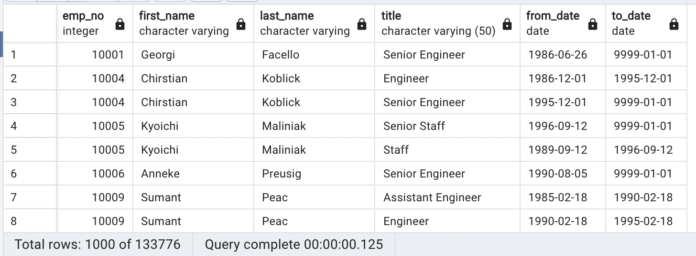
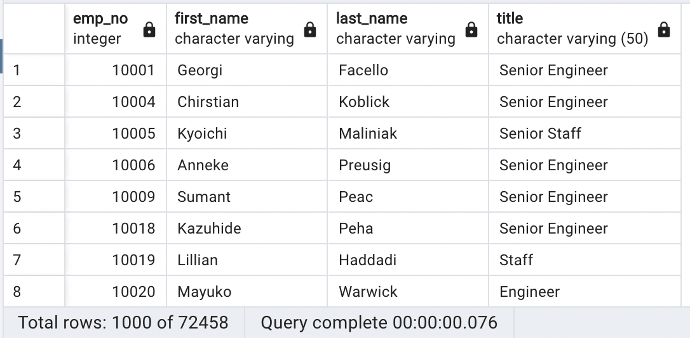
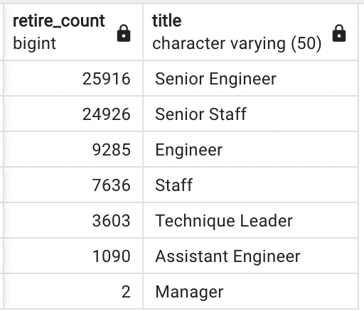
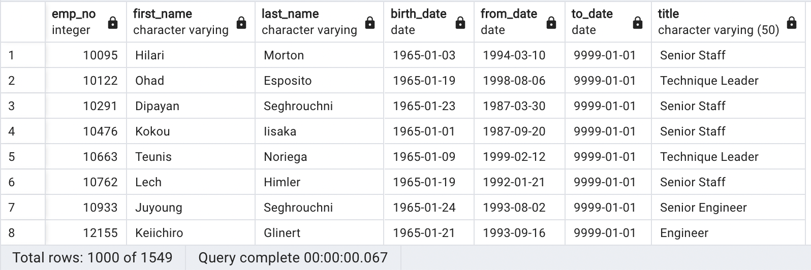
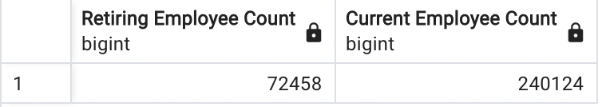
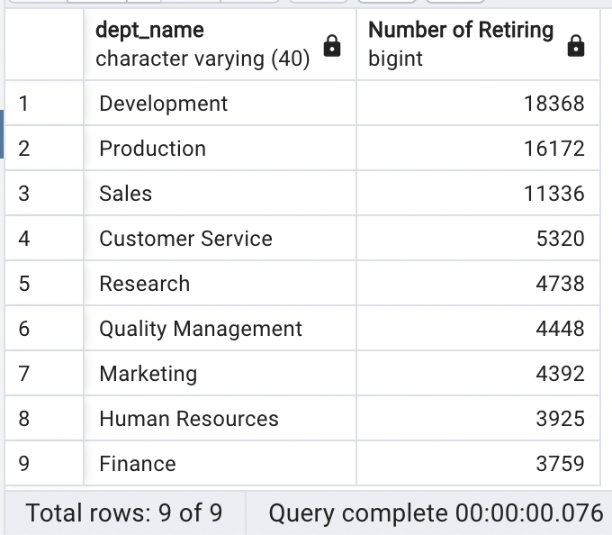
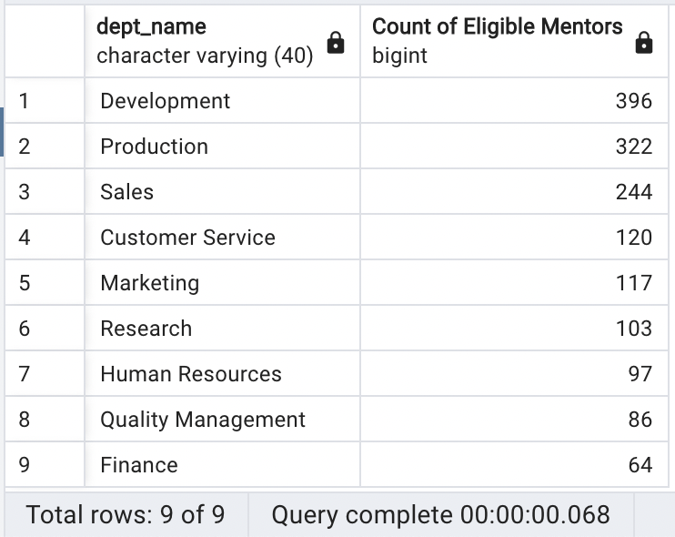

# Pewlett-Hackard Employee Retirement Analysis

## Overview of Project

### Purpose

The purpose of this project is to use `PostgreSQL` and `pgAdmin4` to query and analyze a company's employee information with the following goals:

1. Determine the number of retiring employees per title.
    - Current employees who were born between January 1, 1952 and December 31, 1955.

2. Identify employees who are eligible to participate in a mentorship program.
    - Current employees who were born between January 1, 1965 and December 31, 1965.

## Results

- Upon first querying information on the employees born between January 1, 1952 and December 31, 1955, it was noticed that there were multiple entries for some of the employees. These multiple entries were due to employees having promotions and/or title changes. This table also included employees who had left the company.

- The next query was one that searched for employees who had a job title with a "to_date" column entry of "9999-01-01". This had 2 benefits:
  - It eliminated multiple entries per "emp_no" by only allowing for current roles to be in the query.
  - It returned only currently working employees.

- Retirement count by job title:

- Querying in much the same as above, but looking for employees born between January 1, 1965 and December 31, 1965, returned employees eligible for the mentorship program. 

## Summary

### Roles to Fill

In total during this round of retiring employees, there will be 72,458 people retiring:
- Senior Engineer : 25,916
- Senior Staff : 24,926
- Engineer : 9,285
- Staff : 7,636
- Technique Leader: 3,603
- Assistant Engineer: 1,090
- Manager: 2

It appears that the amount of employees retiring is **30.18%** of the total current employees.

These retiring employees can be further broken down into how many employees per department are leaving.

### Mentorship Eligibility

There are a total of 1,549 retirement-ready employees eligible to mentor the next generation of employees. Of those 1,549, I made another query to see which departments they were part of. This is to provide insight into the assortment of expertise available for the mentorship program across departments. 

