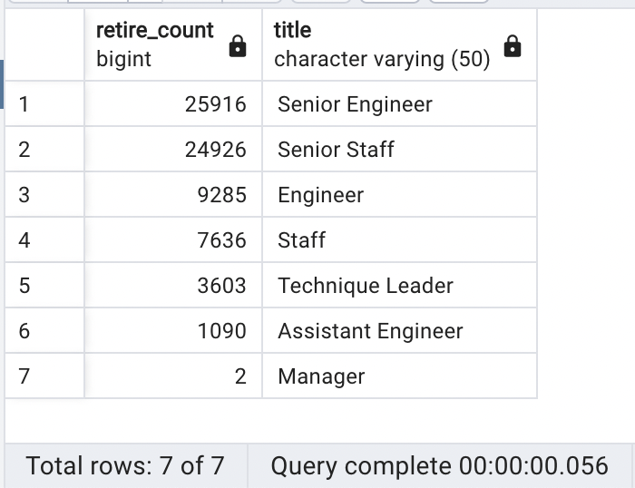

# Pewlett-Hackard Employee Retirement Analysis

## Overview of Project

### Purpose

The purpose of this project is to use `PostgreSQL` to analyze a company's employee information with the following goals:

1. Determine the number of retiring employees per title.
  - Current employees who were born between January 1, 1952 and December 31, 1955.

2. Identify employees who are eligible to participate in a mentorship program.
  - Current employees who were born between January 1, 1965 and December 31, 1965.

## Results

### Retiring Employees Per Title

- Retirement count by job title:

- Total count of retiring employees:

### Employees Eligible for Mentorship Program

- Number of eligible 
- 

## Summary

